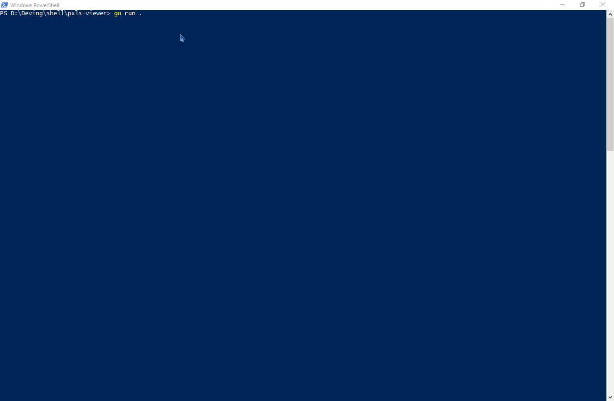
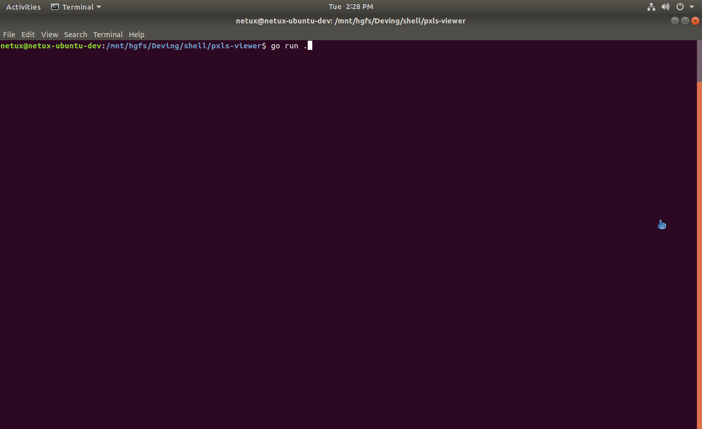

# Console Pxls viewer

View a Pxls canvas on the command-line!

## Known bugs

- Windows has fewer, wronger colors
  - this is due to the library that's used ([termbox-go](https://github.com/nsf/termbox-go/)) not supporting xterm 256 colors at the time of this writing.
- Mingw on Windows not rendering anything
  - no idea why this happens
- Moving horizontally goes twice as fast than moving vertically

## Controls

* Drag your mouse to scroll through the canvas.
* Use the arrow keys to move faster.
* Ctrl+C exists.

## Arguments

`--host`: the hostname of the pxls server. Default is "pxls.space"

`--secure`: whether the connection should be secure (use https: and wss: protocols) or insecure (use http: and ws: protocols). Default is true.

---

## Screenshots

Powershell in Windows:

Ubuntu with Xterm color palette (full of visual glitches, but pretty colors)

